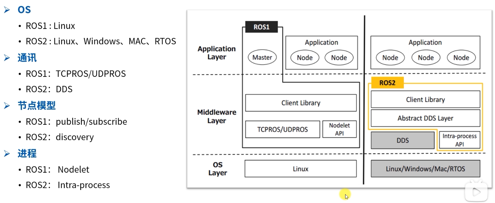
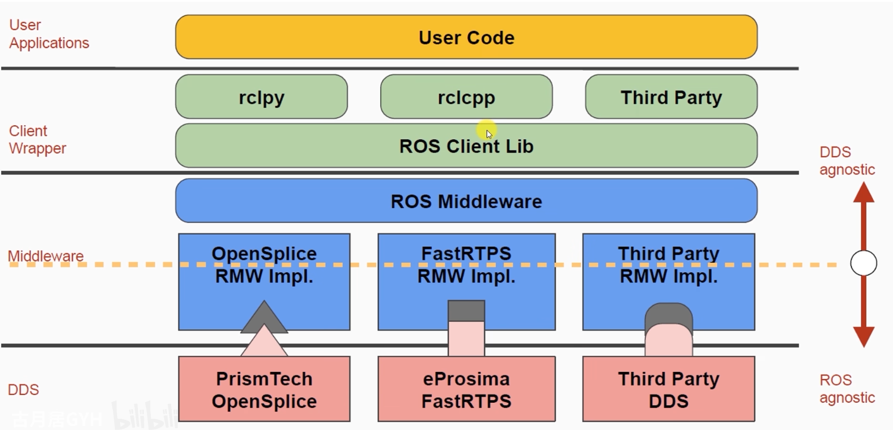
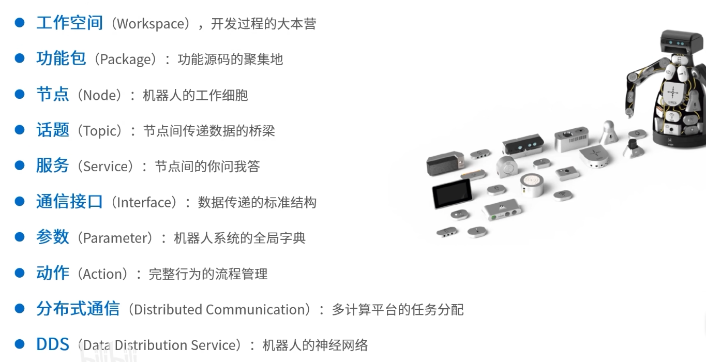

# ROS2对比ROS1
## 起因
由于ROS1针对PR2机器人开发，主要考虑单个机器人的问题； 
随着机器人的发展，只能机器人时代提出更多样的需求：
- 多机器人系统；
- 网络连接；
- 跨平台：windows\rtos等；
- 产品化；
- 实时性；
- 项目管理；

## 差异
- 架构：ROS2不再需要master节点，使用基于DDS的Discover机制

- API
- 编译方法：ROS1使用rosBuild\catkin；ROS2使用ament\colcon

## 核心概念

