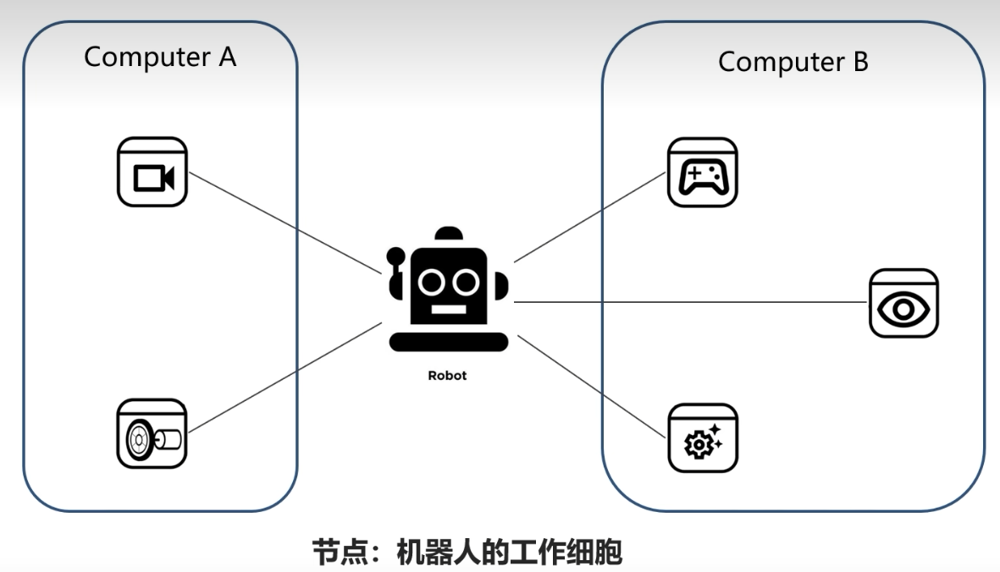
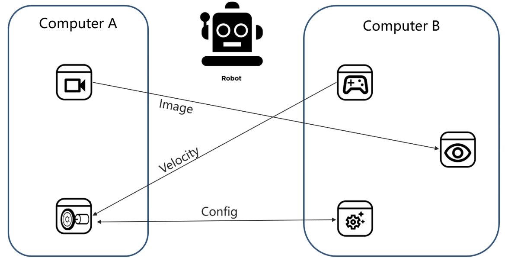

# 节点-机器人工作的细胞

- 作为独立运行的进程
- 可使用不同的语言编写
- 分布式系统架构
- 通过节点名称进行管理



节点之间并不是孤立的，他们之间会通讯机制连接。



## 创建节点

节点内部的代码流程：

- 编程接口初始化
- 创建节点并初始化
- 实现节点功能
- 销毁节点并关闭接口

完成代码的编写后需要设置功能包的编译选项，让系统知道Python程序的入口，打开功能包的setup.py文件，加入如下入口点的配置：

```json
entry_points={
    
'console_scripts': [
     
'node_helloworld       = learning_node.node_helloworld:main',
     
'node_helloworld_class = learning_node.node_helloworld_class:main',
     
'node_object           = learning_node.node_object:main',
     
'node_object_webcam    = learning_node.node_object_webcam:main',
    
],
```
