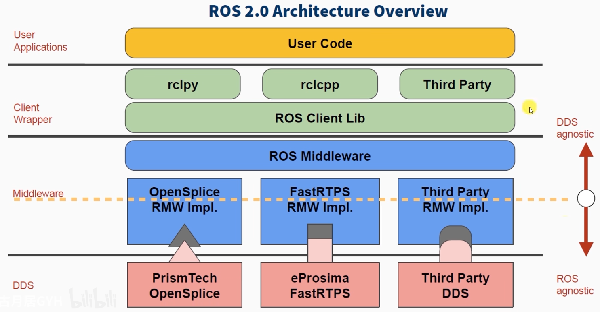
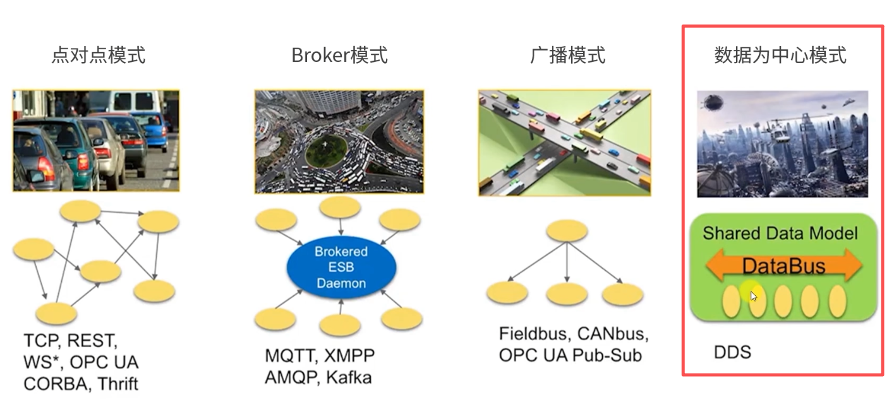
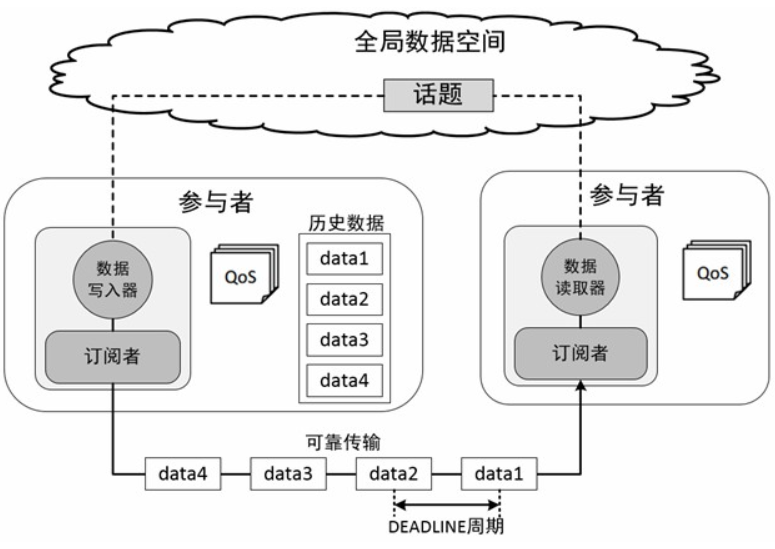
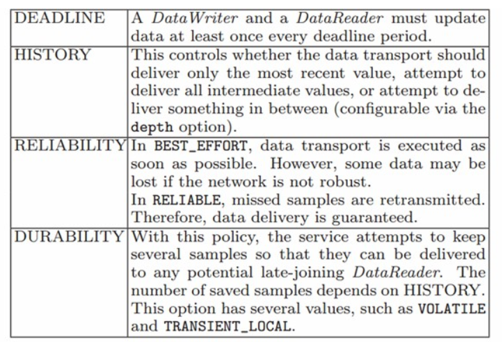
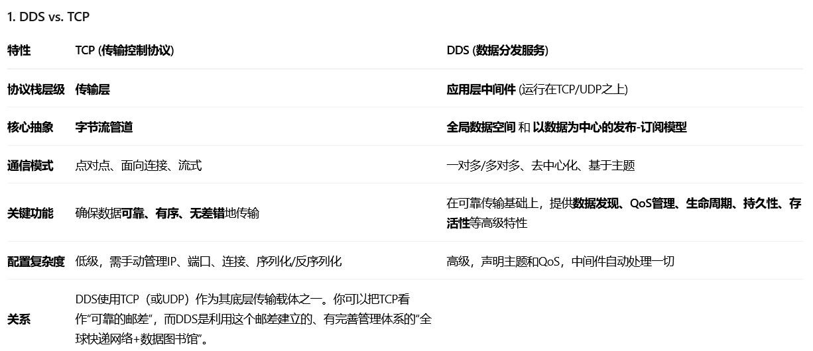
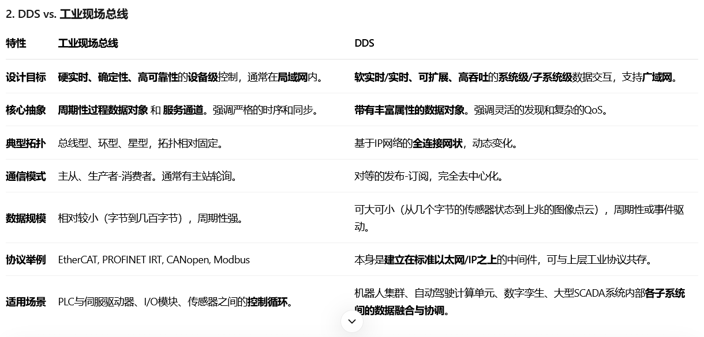

# DDS

## 概述

data distrabution service，即数据分发服务。

专门为实时系统设计的数据分发|订阅标准。

DDS强调以数据为中心，提供丰富的服务质量策略（QoS），以保障数据进行实时、高效、灵活的分发，可满足各种分布式实时应用需求。

话题、服务、动作、参数的底层实现都依赖DDS。

## 通信模型

和广播模型有相似之处，但内部有很多并行的通路，只关心自己感兴趣的数据。

## DDS在ROS中的特性

### Domain

只有在同一个Domain小组中的节点才能通信。

### QoS

质量服务策略，可以理解为数据提供者和接收者之间的合约。

- DEADLINE策略，表示通信数据必须要在每次截止时间内完成一次通信；
- HISTORY策略，表示针对历史数据的一个缓存大小；
- RELIABILITY策略，表示数据通信的模式，配置成BEST_EFFORT，就是尽力传输模式，网络情况不好的时候，也要保证数据流畅，此时可能会导致数据丢失，配置成RELIABLE，就是可信赖模式，可以在通信中尽量保证图像的完整性，我们可以根据应用功能场景选择合适的通信模式；
- DURABILITY策略，可以配置针对晚加入的节点，也保证有一定的历史数据发送过去，可以让新节点快速适应系统

## 一些理解

## vs TCP

## vs 工业总线

- DDS + ROS 2​ 是大脑和神经系统，负责高级的、灵活的、系统级的信息协调与决策。
- 工业实时总线​ 是脊髓和运动神经，负责底层的、强实时的、确定性的精准运动控制。
