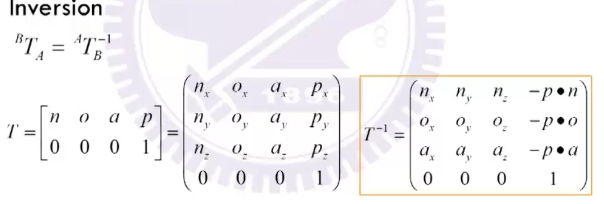
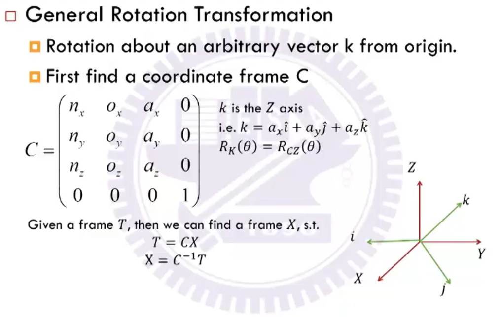
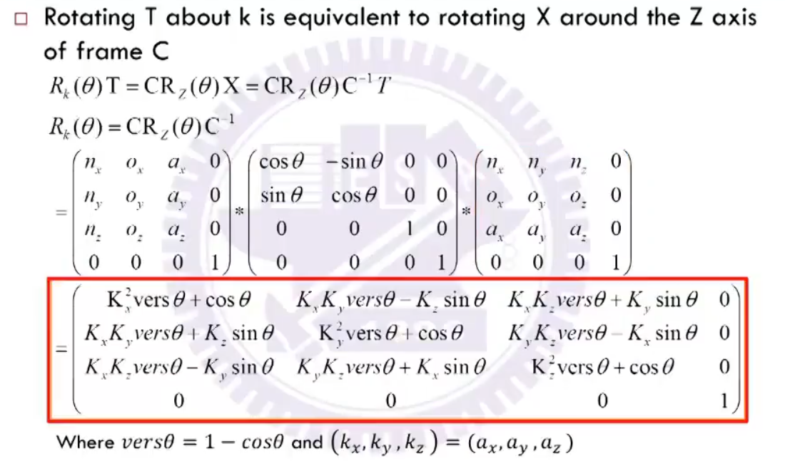
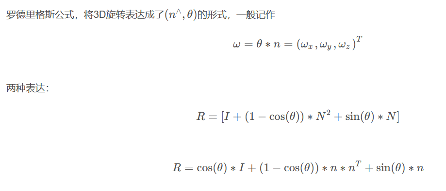
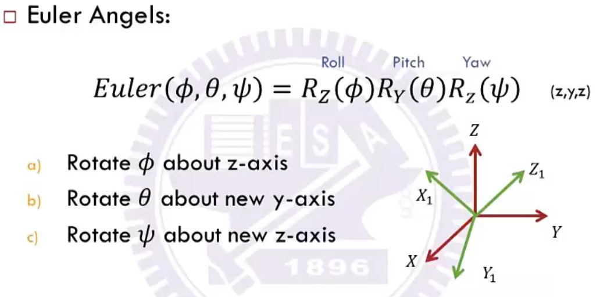
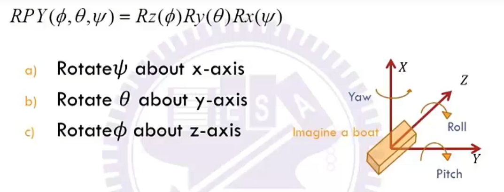

# 机器人学-数理基础
## 齐次矩阵的左乘右乘
- 左乘：以世界坐标系为参考
- 右乘：以上一个坐标系为参考
在多轴机器人中，基本都是右乘

## 齐次矩阵的逆
将旋转矩阵和平移向量单独计算，旋转矩阵求逆等于转置，平移向量求逆等于，负的平移向量点乘旋转矩阵的分量。

## 如何求解绕任意轴旋转的旋转矩阵

***理解： 
T = CX ->X在C坐标系下，T在世界坐标系下，X为T在C坐标系下的表达 
因此T绕k轴旋转，等价于X绕C的Z轴旋转，最后将其都转换到世界坐标系下，相等。***

## 如何求解旋转矩阵对应的旋转轴
通过罗德里格斯方程可求解； 
常规可直接通过opencv的api计算； 
[推导过程](https://zhuanlan.zhihu.com/p/451579313)

## 角度表示旋转
### 欧拉角(euler)

欧拉角使用右乘，使用的是上一次旋转之后的坐标系； 
旋转顺序: Z->Y(new)->Z(new); 
欧拉角使用过程中需要注意旋转方向的退化，即避免旋转轴的方向一致 
**为什么要使用欧拉角?**
 因为任意旋转轴的方向很难直观理解，通过特殊旋转轴来表示相对容易理解，例如欧拉角(z-y-z)，其实z-y-x也是可以的

### RPY(row-pitch-yaw)

RPY使用左乘，一直使用世界坐标系 

