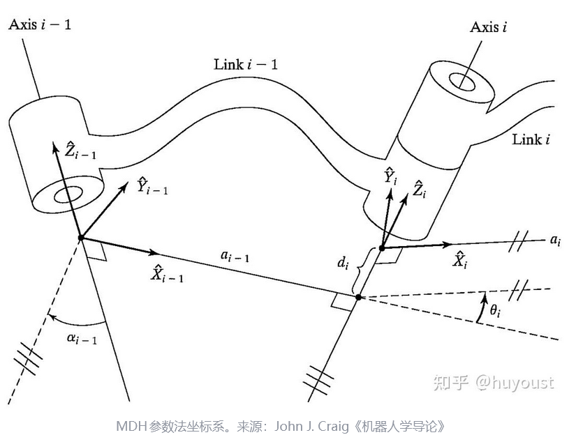
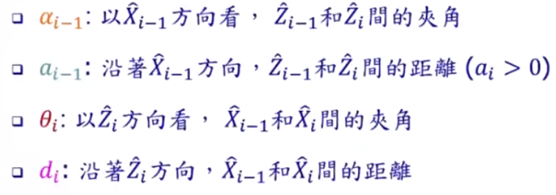
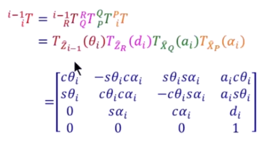
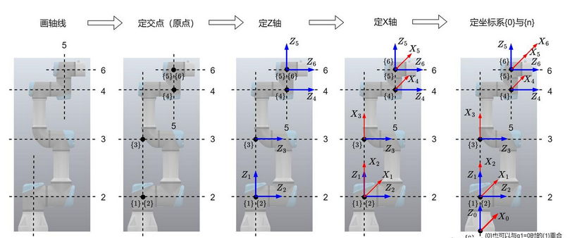
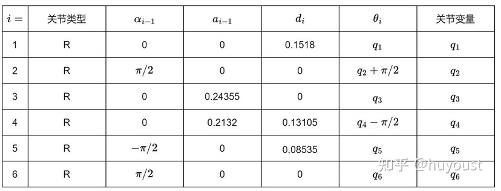

# 机器人学-正运动学
## 研究内容
- 位置
- 速度
- 加速度

## D-H model
**用4个参数表示一个轴**  
DH参数法，通常分为标准和Craig; 
现在说的MDH通常指的是Craig改进的方法； 
主要改进：将坐标系i的坐标原点放在关节i的延长线上（即连杆i的近端） 

**需要重点关注下标**

根据DH参数可求解关节之间的齐次矩阵
### UR3e举例

