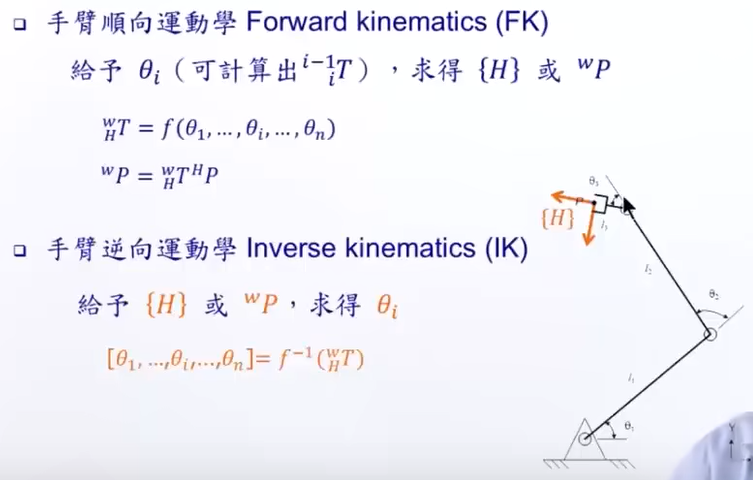
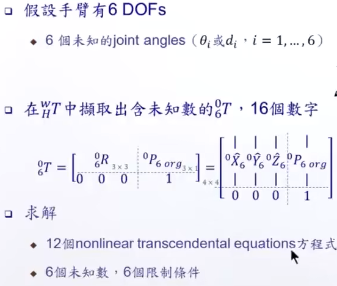
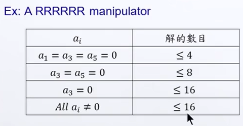

# 机器人学-逆运动学
## 正逆运动学研究的问题

- 正运动学：已知每个轴的角度，求解末端执行器的位置
- 逆运动学：已知末端执行器的位置，求解每个轴需要运动的角度

## 逆运动学求解方式
### 问题分析

### 相关概念
- Reachable Workspace: 手臂可以用一种以上的姿态到达的位置
- Dexterous Workspace: 手臂可以用任意姿态到达的位置
- Subspace: 手臂在定义头尾的T所能到达的范围
### 多重解
虽然是六个未知数对应六个方程，但由于不是线性方程，所以不代表具有唯一解。
对六轴机器人来说：

### 多重解的选择方式
- 距离目前状态最近的解
- 避开障碍物

### 求解
#### 求解方式
- 解析法
    - 代数法
    - 几何法
- 数值法

数值法计算量太大，可能无法满足实时性要求。 
因此现在大多数手臂使用的是解析法。(课本上的说法) 
实际上工程中大多是使用数值解，例如UR协作臂 
因此机械臂设计上需要满足一些条件：
- pieper's solution: 相邻三轴相较于一点

**适用于解析法的大多数机械臂的后三轴会相交于一点。**

#### 求解思路
前三轴的运动对应矩阵中的平移量； 
后三轴的运动对应矩阵中的旋转；