# 机器人学-轨迹规划
## 研究内容
机械臂末端怎么从初识位姿运动到目标位姿，中间可能加入节点位姿
## 理想轨迹
位置和速度必须连续； 
若速度不连续，则需要一个很大的加速度，不现实； 
实际应用中可能会有更高的要求，例如加速度连续等； 
## joint space下的轨迹规划
### 实现步骤
- 定义初识、目标和节点位姿，将齐次矩阵转换成6个参数的表达形式，3个平移加3个旋转；

- 逆运动学求解各关节的角度
- 对关节角度做规划
- 正运动学求解各末端执行器的位姿，验证可行性

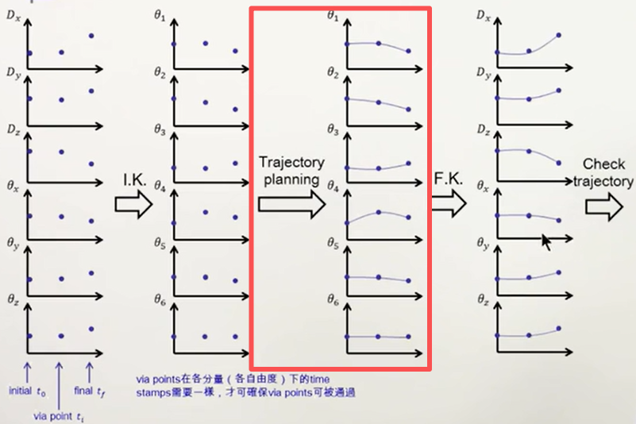

## cartesian sapce下的轨迹规划
### 实现步骤
- 定义初识、目标和节点位姿，将齐次矩阵转换成6个参数的表达形式，3个平移加3个旋转；（同joint space）
- 对所有位姿进行规划
- 对规划的所有位姿进行逆运动学求解，求出所有关节角度
- 在joint space下检查所有角度是否可行

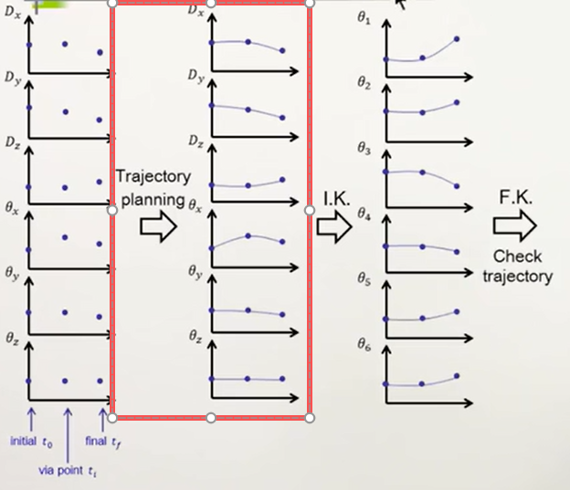

**comments：** 
- 比较直观
- 运算负载较大（逆运动学）

## 轨迹规划的方法
### Cubic Polynomials(三次多项式)
#### 设计原则
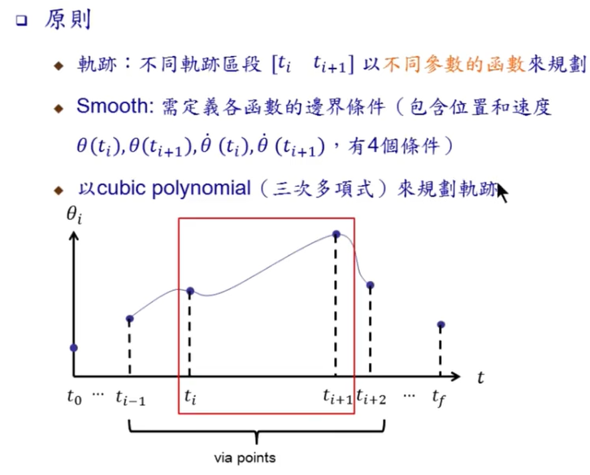
- 每段轨迹分别描述
- 边界条件：位置和速度相等
- 使用三次多项式来规划

#### 求解
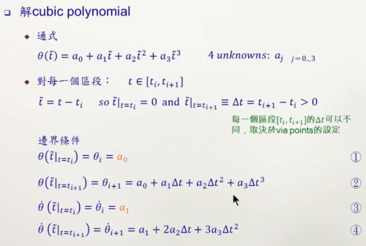
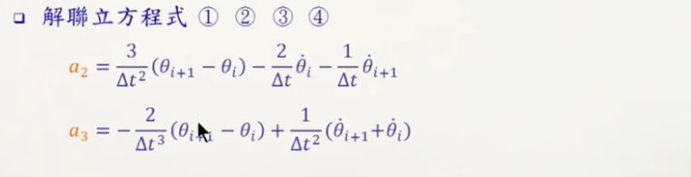
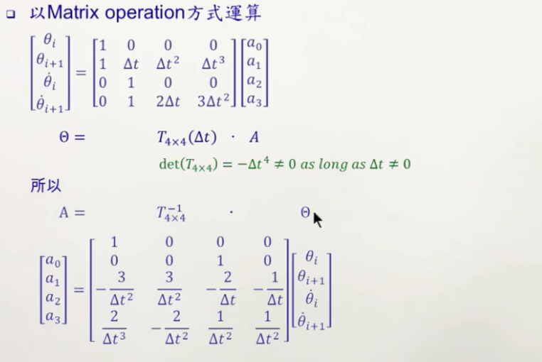

### 多段Cubic Polynomials
#### 如何选择每段边界的速度
- 直接定义：可能存在某些场景需要在某些位置以特定的速度通过；**一般不建议这么做**
- 自动生成，通过一定的规则；
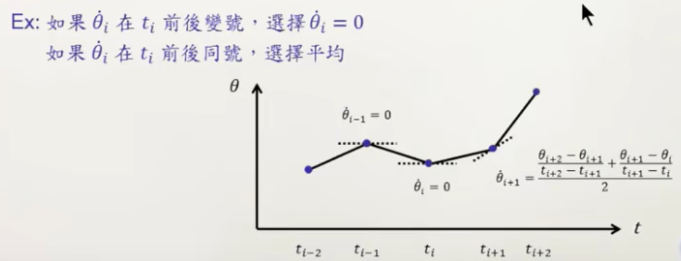
 **以上两种方式每段多项式可以单独求解**
- 设定加速度也连续（这是一种很有益的条件，保证机械臂运行的更加流畅）
 **不同段的多项式需要合并求解**
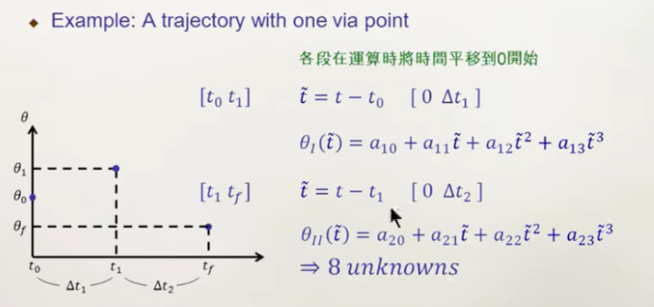
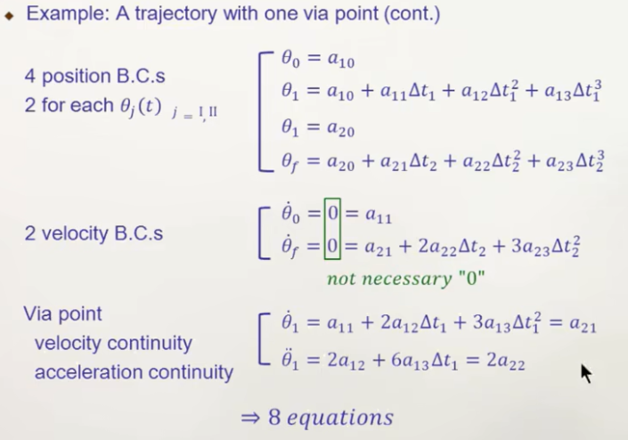
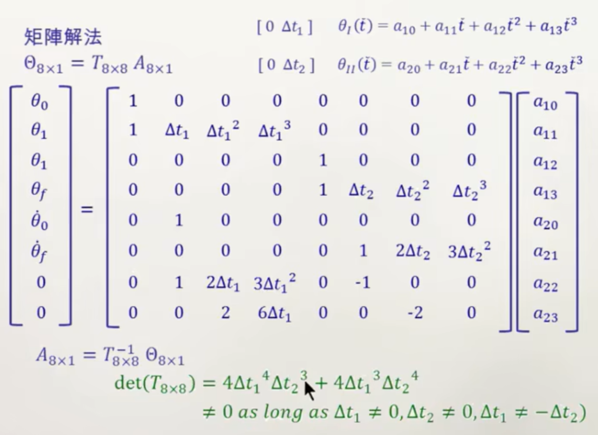

### General Cubic Polynomials
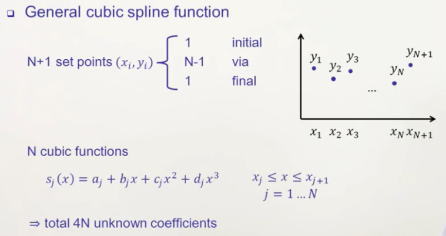
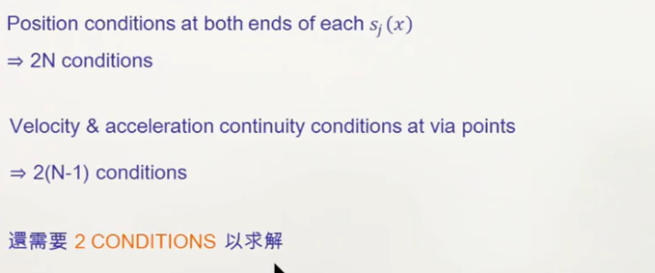
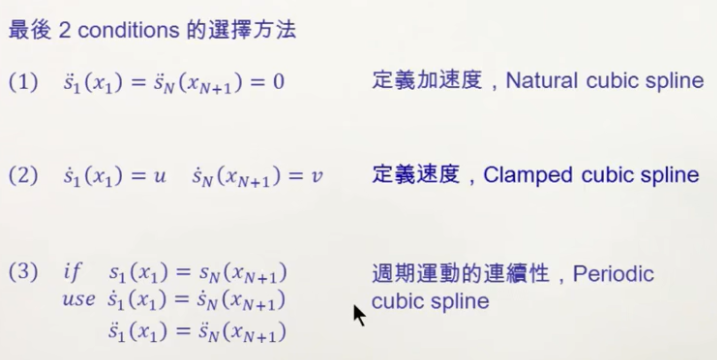
最后两个条件的选择很灵活，可根据具体情况判断。

### High-order Polynomials
如果位置、速度、加速度都需要进行规划，那就需要使用5次多项式；
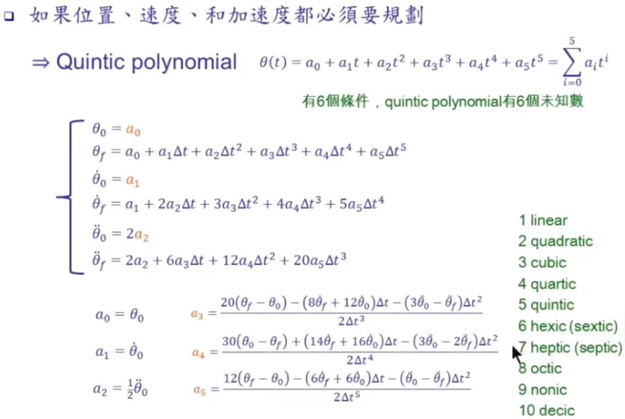

### 直线轨迹
直线轨迹在很多场景下都会使用，但如果轨迹中包含多段直线，线段之间的转折点速度会不连续，也就会导致加速度无限大。 
**解决方法：** 将直线两端修正为二次方程式，让速度轨迹smooth。
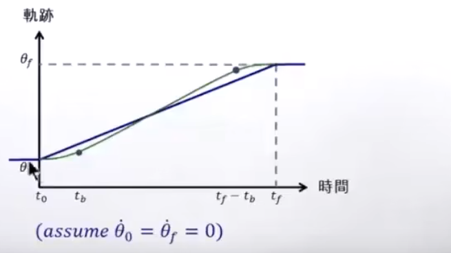
**规划方式：**
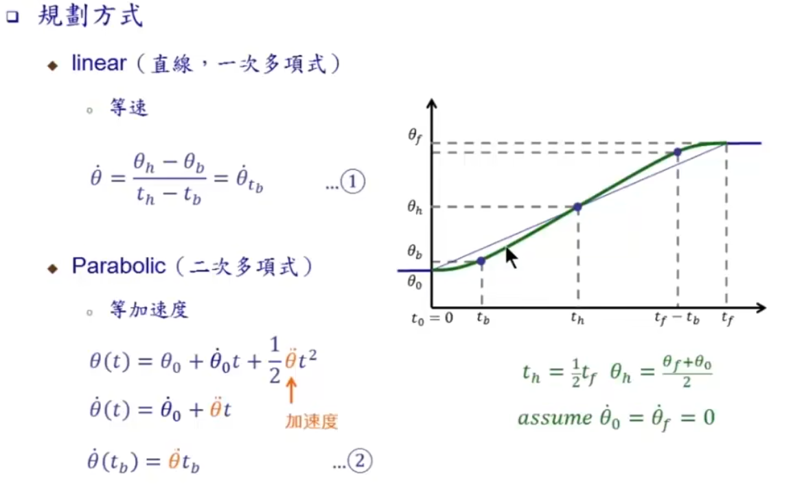
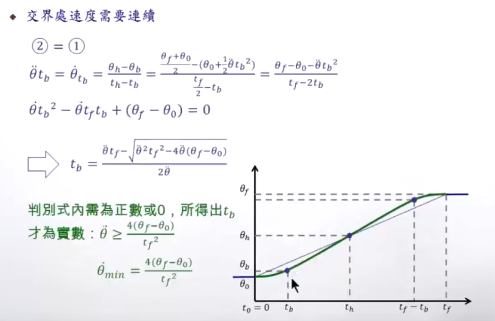
**跳过，有需要再看**

## 几何限制
- 中间有些区段无法到达（在workspace之外）
- 轨迹中需要高加减速
- 针对特定起始和终点姿态，无法产生连续轨迹
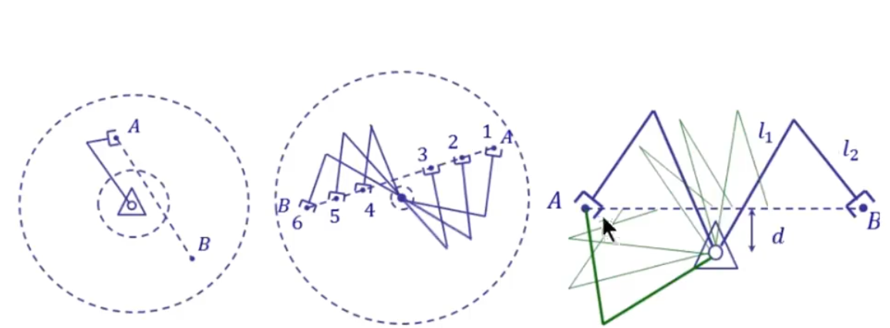

